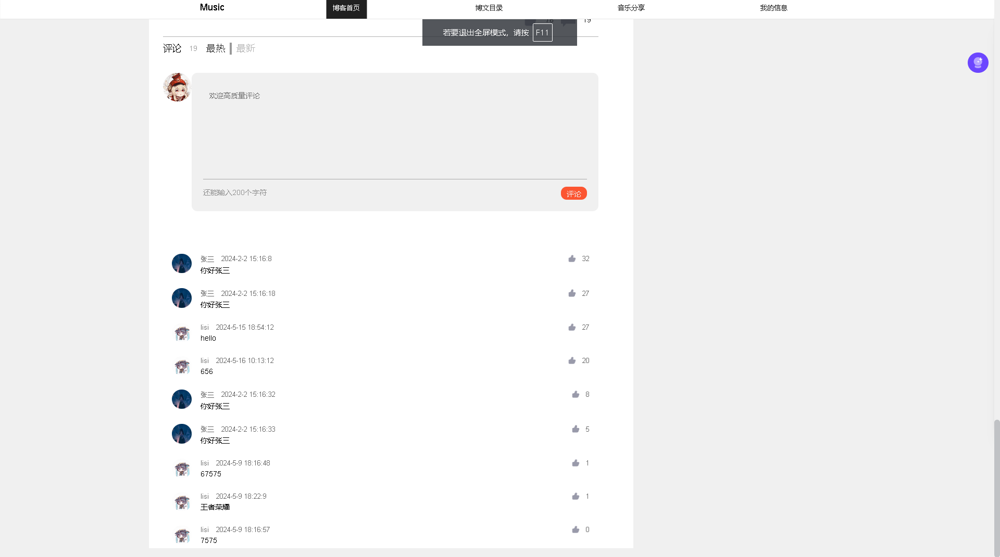
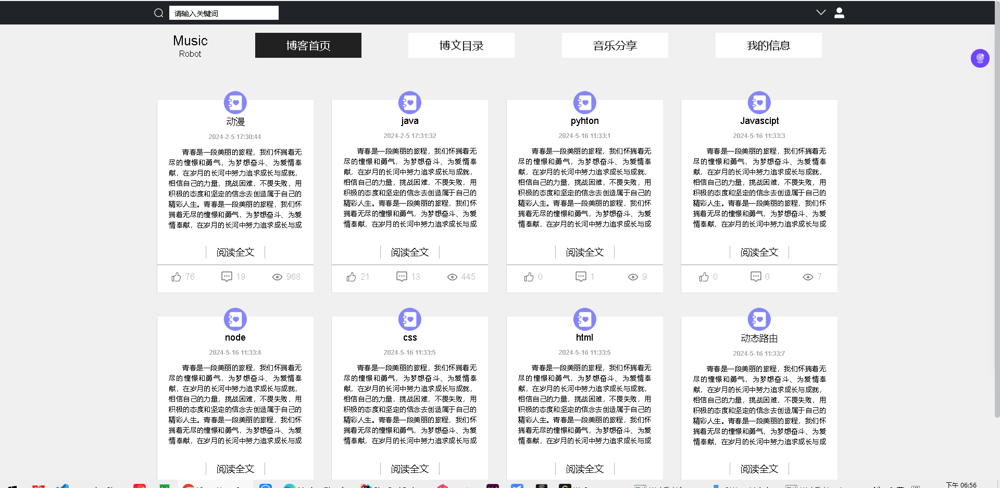
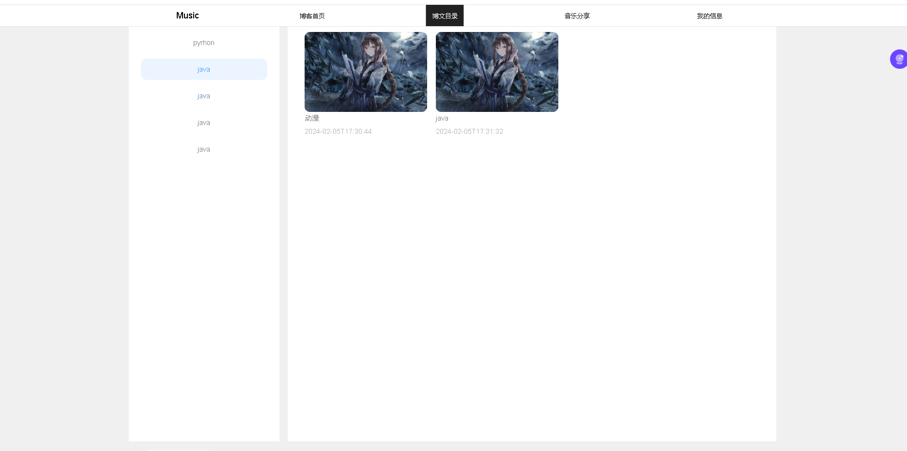
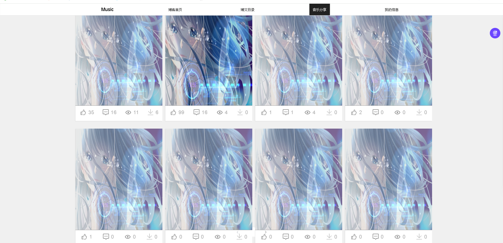
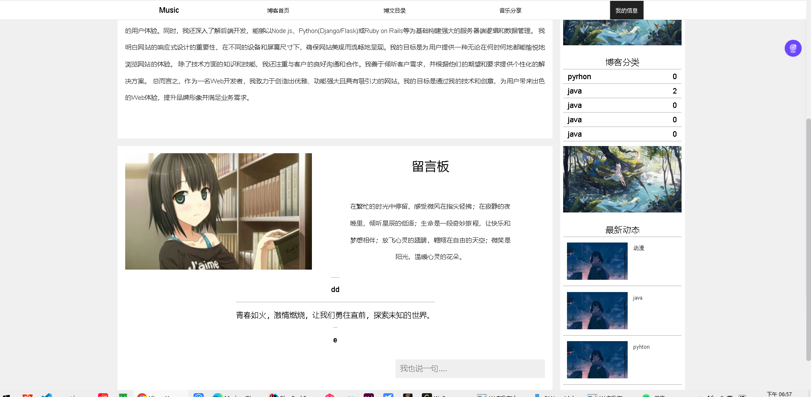
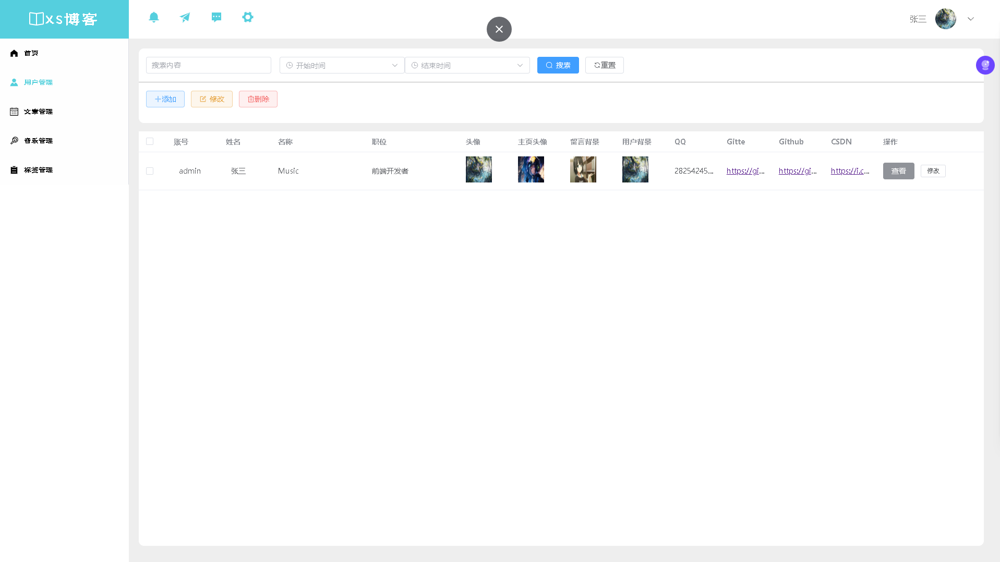
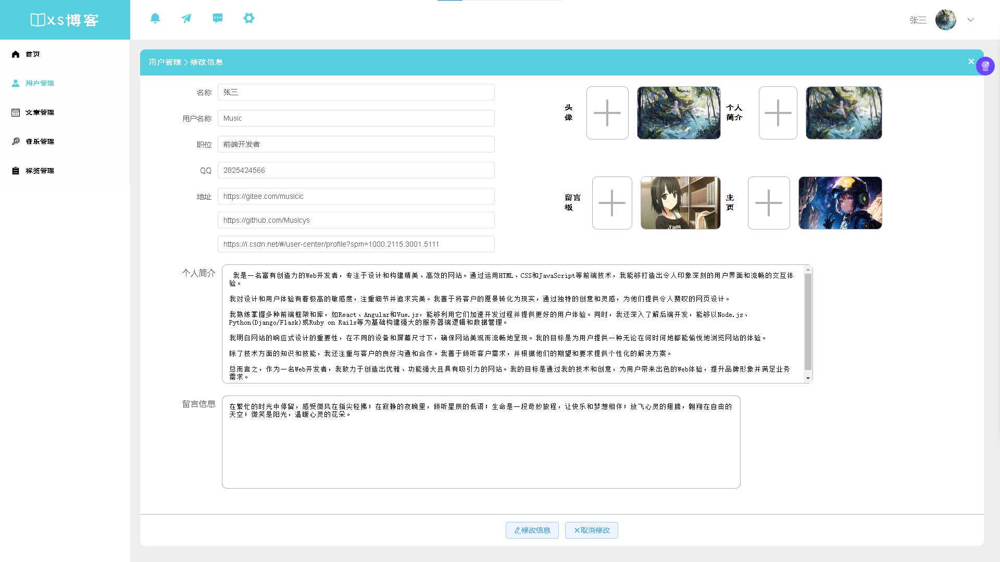
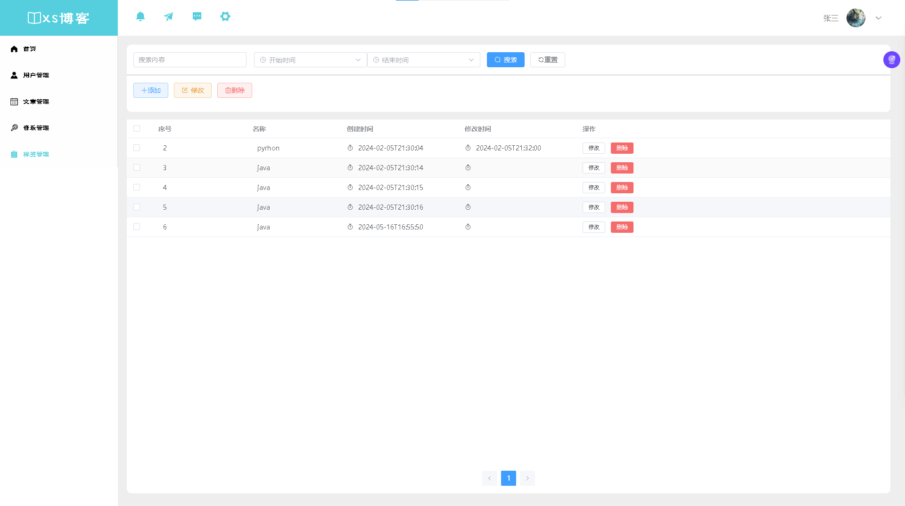

<<<<<<< HEAD


# 创建

```npm install -g create-vite```
```create-vite name```

# 启动
npm install
npm run dev
# Vue3
```

npm install element-plus
<<<<<<< HEAD

# 线上版本 1 23
=======
```
···
npm install element-plus


# 开发版本

目前设想开发个人，不涉及多用户

# 功能

- 用户管理
- 角色管理
- 菜单管理
- 权限

# 界面













# 后台：





>>>>>>> master
